# Organized Development with Tmux

<http://preaction.github.io/articles/tmux/talk/chicago>

by [Doug Bell](http://preaction.me)  
<small>(he, him, his)</small>  
[<i class="fa fa-twitter"></i> @preaction](http://twitter.com/preaction)  
[<i class="fa fa-github"></i> preaction](http://github.com/preaction)  

[Chicago.PM](http://chicago.pm.org)  

[<i class="fa fa-file-text-o"></i>
Full Article](http://preaction.me/articles/tmux)  

[CC-BY-SA 4.0](https://creativecommons.org/licenses/by-sa/4.0/legalcode)  

<small data-markdown>
For navigation help, press `?`  
For speaker view, press `S`  
For full-screen, press `F`
</small>

--- {Topic}

# Tmux

^ Since showing is better than telling, I'm going to show you what Tmux
does.

---

# `screen`

^ But first, who has used GNU screen? Okay, so a lot of this will be
familiar to you.

---

# Installing

^ We're not going to go over installing Tmux. It's available from all
major package managers including Homebrew for MacOS, Cygwin, and works
inside Windows Subsystem for Linux (Ubuntu-in-Windows)

--- {Topic}

# Starting Tmux

^ To start Tmux, we need to run the `tmux` command

---

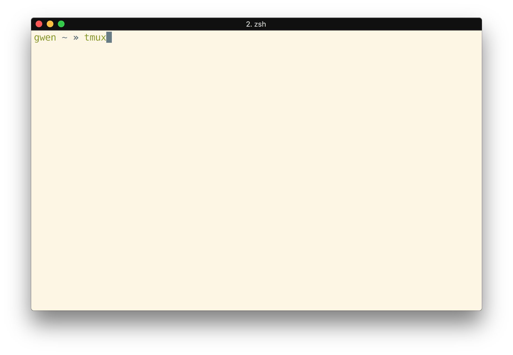

^ Once we run this command...

---

^ We get a shell prompt again, but now we have a bar at the bottom of
the window. This is the Tmux status bar.

---

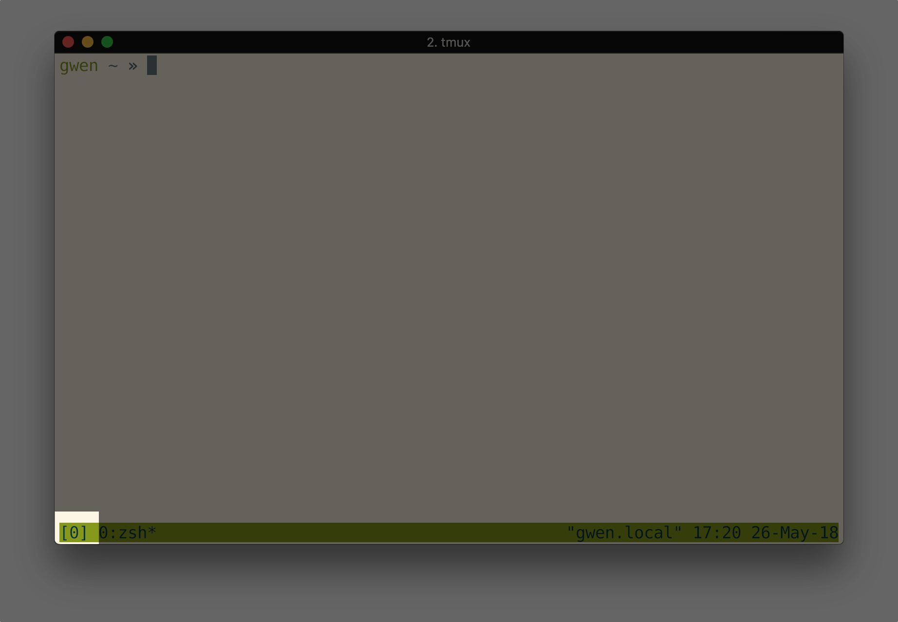

^ Over in the bottom left in square brackets we have the session name,
which defaults to `0`. We'll talk about using session names later.

---

<h1 class="fragment solarized-bar-text absolute-center">
    0:zsh*
</h1>
<!-- It took 30 minutes to make this work correctly, so I need to stop
thinking that I can just "do my slides" in the hour before the talk,
after I've written the full talk in prose -->

^ Next to that we have window information. >> We have one window, >> window 0,
>> currently running `zsh` (my shell), >> and the asterisk says it is the
selected window. Creating and managing windows is the most useful part
of Tmux, and we'll spend a lot of time talking about them.

---

^ Finally, on the right, we have some information about our machine: My
laptop's hostname is "gwen.local", and this screenshot was taken at 8:32
PM on May 22, 2018.

---

^ Otherwise, this is just what we had without Tmux. We can type
a command into our shell and execute it...

---

^ and the output is displayed on our screen. Amazing!

---

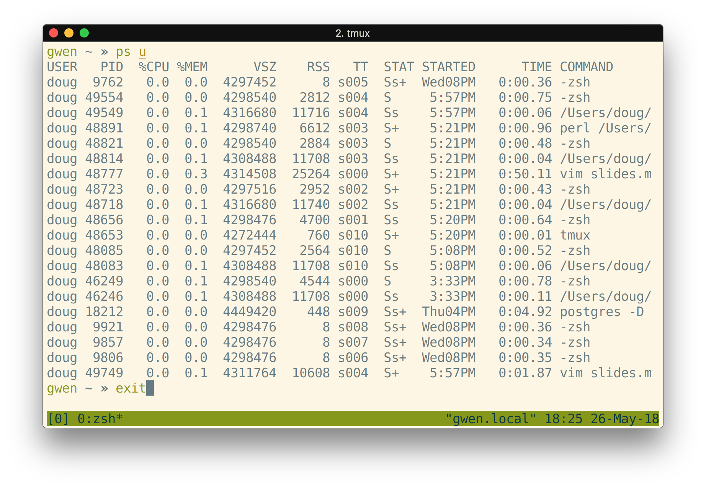

^ And then when we're done, we can exit our shell

---

^ And we exit Tmux.

--- {Topic}

# Detach
<h1 class="fragment">Attach</h1>

^ However, instead of exiting, we can detach from our Tmux session and
re-attach to it later. When we detach from a session, Tmux stays running
in the background. Everything in our session keeps running, too, waiting
for us to return.

---

^ So let's start Tmux again

---

<h1 class="fragment absolute-center bg-solarized">
    <kbd>
        Ctrl+b
        d
    </kbd>
</h1>

^ But this time let's detach from our session instead of exiting. We do
this by typing "Ctrl+b d". >> "Ctrl+b" is the prefix. Typing this tells
Tmux we're about to give it a command. >> And then "d" for "detach". If
you're a screen user, screen uses "Ctrl+a" as its prefix by default, and
later I'll show how to configure what the prefix is if you prefer
"Ctrl+a".

---

^ When we detach, we're back in our terminal window where we left off.
But our Tmux session is still running.

---

^ To get back to our session, we can run "tmux attach-session", or for
brevity "tmux attach", or for even more brevity "tmux a".

---

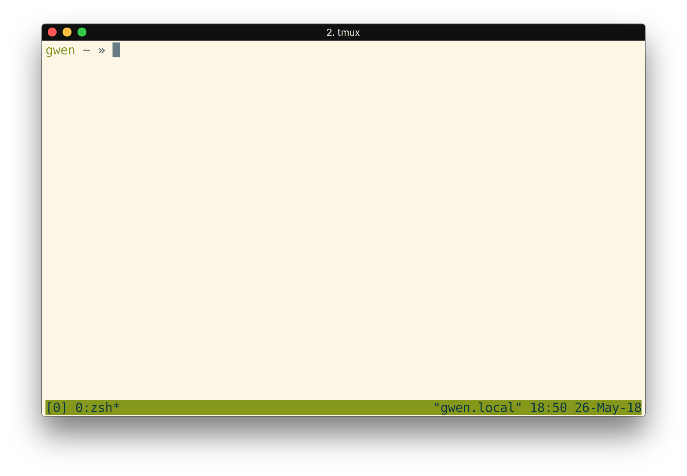

^ When we do that, we're right back where we left off.

---

# SSH

^ Why is this useful? The most common use is over SSH. Connect to
a remote machine via SSH and then run Tmux. If you detach, or get
disconnected, you can later reattach and pick up where you left off. For
some people, this is the only reason they use Tmux.

---

# Detached Tasks

^ This is also good for just putting local tasks in the background,
unattached to any terminal. There are other ways to do this, nohup and
disown, but Tmux makes it easier to get back to those tasks later (it's
not impossible with nohup/disown, just more difficult / annoying).

---
{Topic}

# Windows

^ Now that we've reattached, we can try some other features. The name
"Tmux" stands for "Terminal Multiplexer", making one terminal act like
multiple terminals. The first way we can do that is with windows.

---

^ Here we are back in Tmux.

---

^ Remember that we already have one window, window 0. Let's open a
program in this window. I'll open my editor, Vim.

---

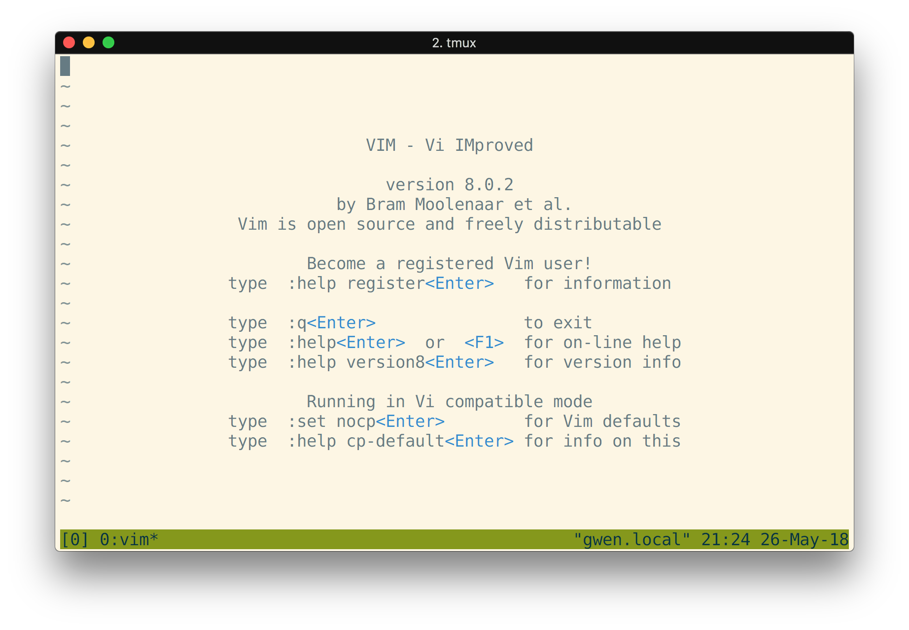

<h1 class="fragment absolute-center bg-solarized">
    <kbd>
        Ctrl+b
        c
    </kbd>
</h1>

^ Okay, now this window is busy running Vim. In order to also do
something else, we will need to open a new window. >> We can open a new
window with "Ctrl+b c". "Ctrl+b" is the prefix, and "c" for "create
window".

---

^ Now we have a new window, with a new shell.

---

<h1 class="fragment solarized-bar-text absolute-center">
    1:zsh*
</h1>

^ Our new window is >> window number 1, >> running "zsh", >> and is our
current window.

---

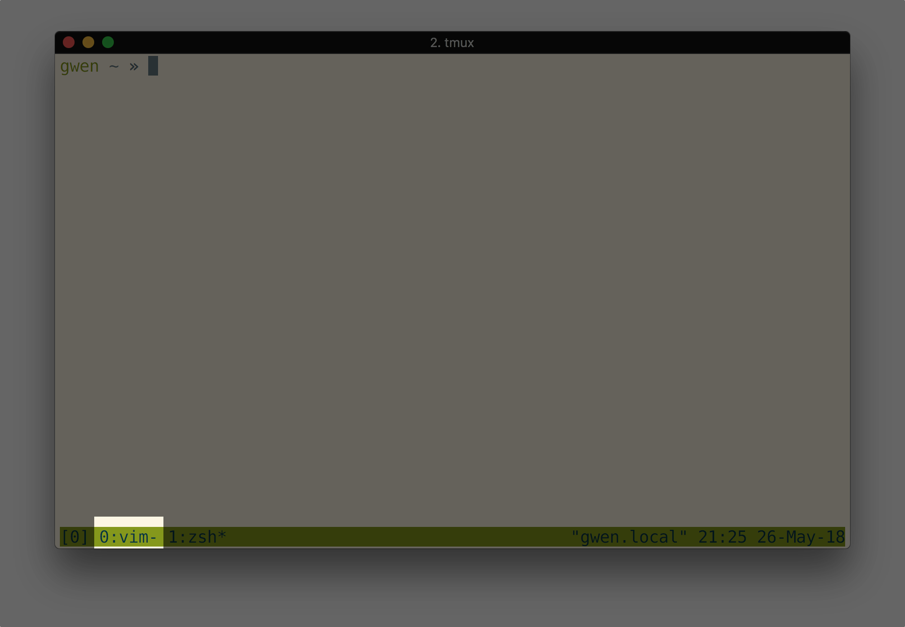

<h1 class="fragment solarized-bar-text absolute-center">
    0:vim-
</h1>

^ And notice our old window now has a >> dash ("-") instead of an
asterisk. This means it was the previous window we were looking at.
There's a lot of information packed in to a tiny space down here.

---

<h1 class="fragment absolute-center bg-solarized">
    <kbd>Ctrl+b l</kbd>
    <kbd class="fragment">Ctrl+b p</kbd>
    <kbd class="fragment">Ctrl+b 0</kbd>
</h1>

^ Now, how do we get back to our Vim window? We have multiple ways. >>
Since it was the previous window, we can use "Ctrl+b l" ("l" for the
last window we were on). "Ctrl+b l" allows you to quickly toggle between
two windows. >> We can use "Ctrl+b p" to go back to the previous window
numerically in the list >> Or we can choose our window by its number
with "Ctrl+b 0". The last one is made more difficult because the first
window is window 0, but we'll go over how to configure that to make the
windows start at 1.

---

<h1 class="fragment absolute-center bg-solarized">
    <kbd>Ctrl+b l</kbd>
    <kbd class="fragment">Ctrl+b n</kbd>
    <kbd class="fragment">Ctrl+b 1</kbd>
</h1>

^ Doing any one of these will bring us back to our Vim window. Then, to
get back to our new window, we can do >> "Ctrl+b l" again, since it was
our last window >> "Ctrl+b n", to move to the next window numerically >>
or "Ctrl+b 1" to go directly to window 1.

---

^ Then we can run commands in this new window

---

^ Like look up some documentation for Tmux

---

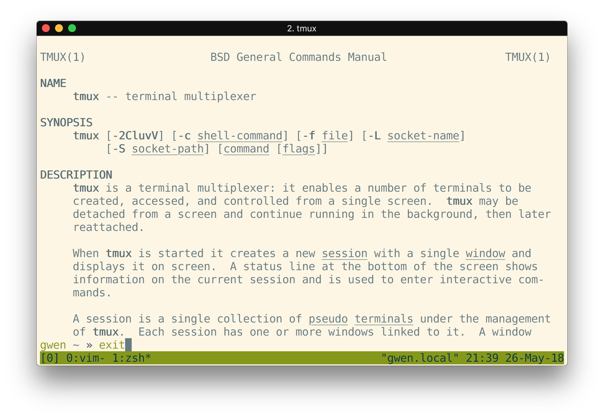

^ And then when we're done, we exit the shell

---

^ We're back to our last window.

---

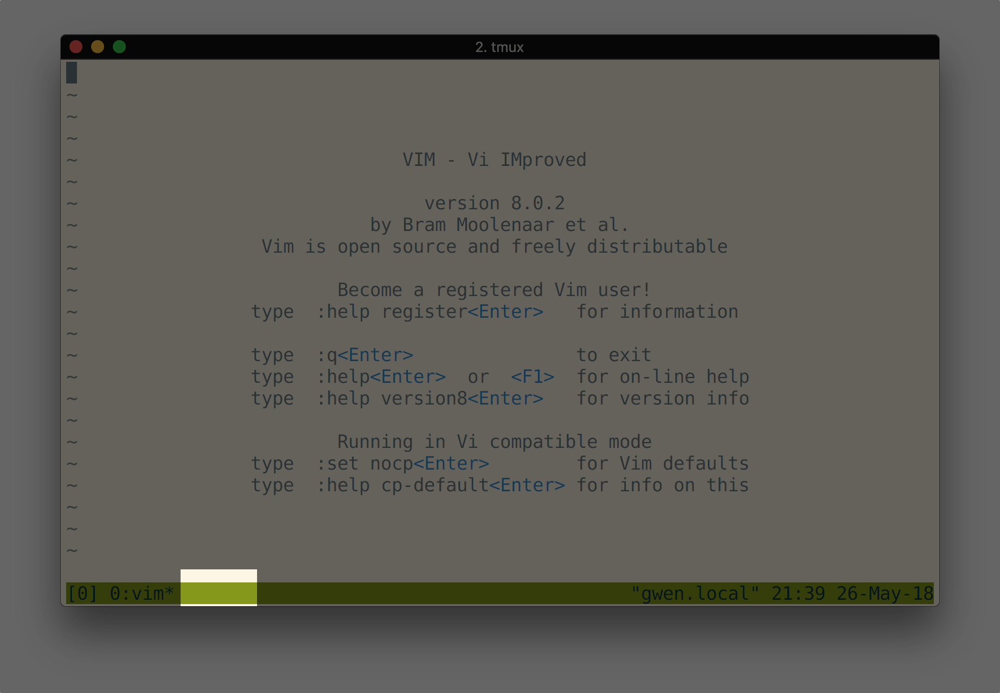

^ And our new window is destroyed.

---
{Topic}

# Scroll Buffer

^ The next thing a new Tmux user comes across is that their terminal's
scroll bar doesn't work anymore.

---

^ We can run a command...

---

^ ... that prints out a lot of data, and when we use our mouse to try to
scroll our terminal window back up to see the top...

---

^ We scroll through the terminal, not the output. Sometimes, we won't
scroll at all.

---

<h1 class="fragment absolute-center bg-solarized">
    Copy Mode
    <kbd class="fragment">Ctrl+b [</kbd>
</h1>

^ This happens because Tmux is keeping the output in a buffer. This is
good, it means we can come back to it later. But it means that we need
to tell Tmux we want to scroll through the buffer by >> entering "copy
mode". We enter "copy mode" by >> pressing "Ctrl+b" and then the left
square bracket ("[").

---

^ In "copy mode" we have two changes to our window.

---

<h1 class="fragment solarized-bar-text absolute-center nowrap">
    1:[tmux]*
</h1>

^ The window name in the bottom bar is >> changed to "tmux" enclosed in
square brackets to show we're in copy mode

---

<h1 class="fragment solarized-search-text absolute-center nowrap">
    [0/4]
</h1>

^ And there are two numbers in the upper right of the screen. >> The
first one shows the line we're on (0 is the bottom of the screen) >> The
second shows the total number of lines in the buffer

---

<h1 class="fragment absolute-center bg-solarized">
    <kbd>⬅️ ⬇️ ⬆️ ➡️ </kbd>
    <kbd class="fragment">PgUp PgDn</kbd>
</h1>

^ We move through the buffer using >> arrow keys >> Page Up / Page Down
keys ...

---

<h1 class="absolute-center bg-solarized">
    <kbd>h j k l</kbd>
    <kbd class="fragment">Ctrl+f Ctrl+b</kbd>
    <kbd class="fragment">g G</kbd>
</h1>

^ ... or Tmux also comes set up with less-style bindings >> (Ctrl+b
goes down, Ctrl+f goes up) >> "g" goes to the top, "G" to the bottom.
and you can configure other styles (vim and emacs)

---

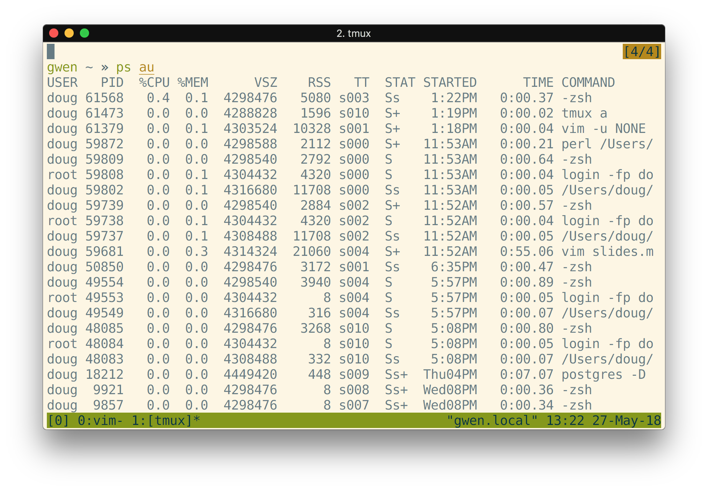

^ I hit the "g" key, and I scrolled all the way to the top. Now I can
hit the "G" key and scroll back to the bottom.

---

<h1 class="fragment absolute-center bg-solarized">
    <kbd>?</kbd>
    <kbd class="fragment">/</kbd>
</h1>

^ We can also move through our buffer searching for keywords using the
>> question mark ("?") key to search up, >> and the slash ("/") key to
>> search down.

---

^ So, to search up we hit the "?" key.

---

<h1 class="fragment absolute-center solarized-search-text nowrap">
    (search up)
    <kbd class="fragment">login</kbd>
</h1>

^ Tmux shows us that we're searching up. >> Then we type what we want to
look for, and press Enter.

---

^ Now Tmux shows us our results

---

^ ... highlights the matched text...

---

^ ... putting our cursor on the bottom one, since we're searching up ...

---

^ and tells us how many results are found.

---

<h1 class="fragment absolute-center bg-solarized">
    <kbd>n</kbd>
    <kbd class="fragment">N</kbd>
</h1>

^ We can see the next search result >> by pressing "n", and the previous
result by >> pressing "N".

---

^ Pressing "n" to go to the next result...

---

^ ... takes me up the page (because I'm searching up).

---

<h1 class="fragment absolute-center bg-solarized">
    <kbd>q</kbd>
</h1>

^ We can exit copy mode by >> pressing "q"...

---

^ and we're back at our command prompt at the bottom of our window

---

<h1 class="fragment absolute-center bg-solarized">
    <kbd>Space</kbd>
</h1>

^ Finally, it's called "copy mode" because we can copy text from the
buffer and paste it later. >> Start selecting text by pressing the space
bar

---

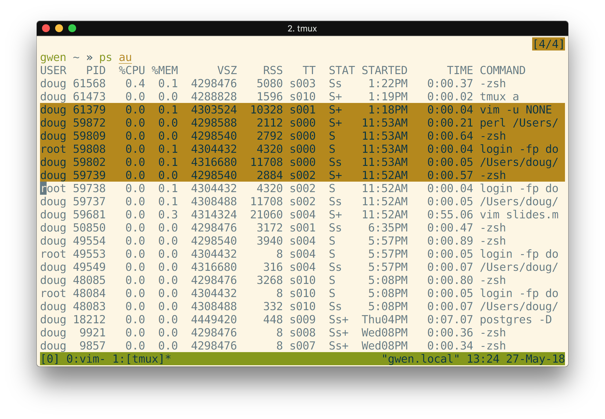

<h1 class="fragment absolute-center bg-solarized">
    <kbd>Ctrl+w</kbd>
    <kbd class="fragment">Enter</kbd>
</h1>

^ Now moving through the text will select it. When we've selected the
text we want, we can >> press "Ctrl+w" >> or "Enter" to copy the text.

---

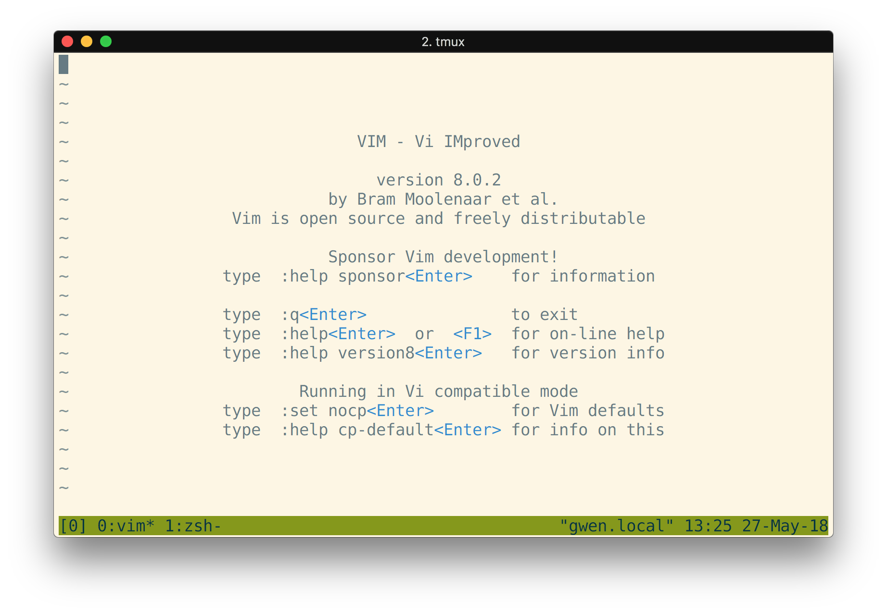

<h1 class="fragment absolute-center bg-solarized">
    <kbd>Ctrl+b ]</kbd>
</h1>

^ And then we can move to another window and >> press "Ctrl+b" and the
right square bracket ("]") to paste the text

---

^ And now our selected text is in our editor. Some of this is a little
awkward. I admit that I rarely use copy mode for its copy/paste
features, mostly for searching program output, which I then select with
my mouse. But there have been some times where copy/paste using copy
mode was the only solution. For example, if the text I want to copy
takes up more lines than can be displayed on the screen.

---
{Topic}

# Window Panes

^ Okay, so, Tmux can create multiple windows, that's great. But what if
I want to look at my editor and my program's output at the same time?
For this, Tmux allows splitting windows into panes.

---

<h1 class="fragment absolute-center bg-solarized">
    <kbd>Ctrl+b %</kbd>
</h1>

^ To split the editor window vertically, use >> "Ctrl+b" and the percent
sign ("%").

---

<h1 class="fragment absolute-center bg-solarized">
    <kbd>Ctrl+b "</kbd>
</h1>

^ Now our window is split in two, with a new shell on the right side. We
can also >> split horizontally using "Ctrl+b" and double quote ('"').

---

^ So, now we split our right pane in two horizontally. And we can keep
going...

---

^ and going...

---

^ and going...

---

^ and going on in to uselessness. Each pane has its own shell and scroll
buffer. When we're done with a pane, we can exit our shell...

---

^ ... and the space gets reclaimed

---

---

---

<h1 class="fragment absolute-center bg-solarized">
    <kbd>Ctrl+b ⬅️</kbd>
    <kbd class="fragment">⬅️ ⬇️ ⬆️ ➡️ </kbd>
</h1>

^ Now we're back to our editor on one side, our shell on the other. To
switch panes to get back to our editor, we can use >> "Ctrl+b" and Left.
>> "Ctrl+b" and the arrow keys moves between the panes in the window.

---

<h1 class="fragment absolute-center bg-solarized">
    <kbd>Ctrl+b z</kbd>
</h1>

^ Now we're back in our editor. If we've split our window, but we need
to look at a pane using all available space temporarily, we can use >>
"Ctrl+b z" to zoom in to the current pane.

---

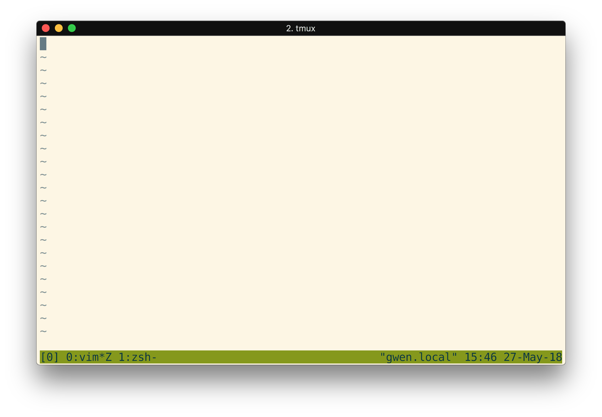

^ Now our editor takes up the full window...

---

<h1 class="fragment solarized-bar-text absolute-center nowrap">
    0:vim*Z
</h1>

^ ... and down here next to our window >> we can see a "Z" to show we're
zoomed.

---
{Topic}

# The Basics of Tmux

<h3 class="fragment">Start / Stop</h3>
<h3 class="fragment">Attach / Detach</h3>
<h3 class="fragment">Windows</h3>
<h3 class="fragment">Scroll buffer</h3>
<h3 class="fragment">Panes</h3>

^ Those are the basics of Tmux: >> Starting and stopping Tmux, >>
Attaching and detaching from Tmux, >> Creating, destroying, and
switching windows >> Using the scroll buffer and copy mode >> And
creating, destroying, and switching panes. With only this, Tmux is
a very useful tool.

---
{Topic}

# Configuration

^ But, we can make it even more useful. The first thing we can do to
maximize Tmux's usefulness is to customize it for our needs. Tmux is
highly configurable, so we can only go over some of the most useful
things here.

---

# Examples

^ These are just examples of things you could do, copied from my own
configs.

---

# Config File
## `~/.tmux.conf`

^ The Tmux configuration file is `.tmux.conf` in our home directory. If
you've never configured Tmux, you'll have to create this file.

---

^ I'm going to open up ~/.tmux.conf in my editor

---

^ And it's currently blank, so let's add some configuration

---

# Setting the Prefix

^ The first thing I do in my Tmux is change the prefix.

---

# Tmux

# `Ctrl+b`

^ Remember "Ctrl+b" is called the "prefix". It's what we use to tell
Tmux we're about to give it a command. But, to me, Ctrl+B is a finger
workout.

---

# Screen

# `Ctrl+a`

^ Screen users often switch this to Ctrl+A, but Ctrl+A is useful
in shells (it moves the cursor to the start of the line).

---

# Custom

# `Ctrl+s`

^ So I use Ctrl+S: The "S" key is on the home row under my fingers, next
to A. And I rarely use Ctrl+S for its original purpose, sending SIGSTOP
to stop a process.

---

<h2 class="fragment solarized-text absolute-center nowrap">
    <code>
        set
        -g
        prefix
        
            C-s
        
    </code>
</h2>

^ To change the prefix, >> we use the `set` command. >> we give a `-g`
option to make it a global setting >> and we set the "prefix" >> to
"C-s". The >> capital-C is "control"

---

<h1 class="fragment solarized-text absolute-center nowrap">
    <code>
        unbind
        C-b
    </code>
</h1>

^ After we change the prefix, we have to do two more things. First, the
default behavior for pressing "Ctrl+b" twice is to send "Ctrl+b" to the
currently-running program. We can stop that behavior by >> using the
`unbind` command to >> stop "Ctrl+b" from doing anything.

---

<h2 class="fragment solarized-text absolute-center nowrap">
    <code>
        bind
        C-s
        send-prefix
    </code>
</h2>

^ Finally, we need a way to send Ctrl+s to the current program just in
case we need to. So, we'll make pressing Ctrl+s twice send a Ctrl+s to
the currently-running program. We configure a key using >> the "bind"
command, which takes >> the key to bind (Ctrl+s) >> and the command to
run ("send-prefix", which sends the configured prefix to our current
program)

---

^ Now our prefix is Ctrl+s, Ctrl+b is just Ctrl+b, and pressing Ctrl+s
twice sends one Ctrl+s to our current program. Note: I will keep calling
the prefix "Ctrl+b" for the rest of this talk, to try to limit
confusion, or increase it, whichever.

---

# Window Index

^ Next, let's renumber our windows.

---

<h1 class="fragment">1 2 3 ... 0</h1>

# 0 1 2 ... 9

^ Having the window number start at 0 is annoying: >> Our keyboards all
start numbering at 1 on the left, with 0 on the right.

---

# 1 2 3 ... 0

# 0 1 2 ... 9

^ If we use the number keys to switch windows, we have to use the right
side of the keyboard to get to the first window on the left.

---

<h2 class="fragment solarized-text absolute-center nowrap">
    <code>
        set -g
        base-index
        1
    </code>
</h2>

^ To fix this, let's >> set (globally) the >> base-index to >> 1.

---

^ Now our windows will start numbering from 1, not 0

---

# Escape Time

^ Next thing we should configure: The default behavior of Tmux is to
have a 1-second delay between when the Escape key is pressed and when it
is sent to the underlying program.

---

# Escape Sequence

<h2>
    <kbd class="fragment">Esc [D</kbd> 
    <kbd class="fragment">Esc [C</kbd> 
    <kbd class="fragment">Esc [1m</kbd>
</h2>

^ This is because the Escape character is the first character in an ANSI
escape sequence, a way to send special commands to terminals. Extremely
special commands like pressing the left arrow to move cursor left,
pressing the right arrow to move cursor right, and making text bold

---

# 🏃 ^[D

<h1 class="fragment">üö∂ ^&nbsp;&nbsp;&nbsp;[&nbsp;&nbsp;&nbsp;D</h1>

<h1 class="fragment">üï∫  ^&nbsp;&nbsp;&nbsp;&nbsp;&nbsp;&nbsp;[&nbsp;&nbsp;&nbsp;&nbsp;&nbsp;&nbsp;D</h1>

^ Since we use the arrow keys to change panes, Tmux has to wait after it
sees an Escape character to see if it's part of an escape sequence.
Normally, this takes almost no time. >> But, if you're on a network, the
gaps between the bytes >> could take a lot longer.

---

# Vim + Tmux

^ But, as a Vim user, I use Escape a lot to escape back to "normal"
mode, the mode that lets me navigate my code. I use it so much I've
gotten extremely fast at it. So fast that the escape delay ends up
ruining whatever I'm trying to do.

---

<h2 class="fragment solarized-text absolute-center nowrap">
    <code>
        set -g
        escape-time
        20
    </code>
</h2>

^ So, let's configure Tmux to spend less time waiting for an Escape
sequence. Let's >> set the >> escape-time to ... >> 20 ms sounds about
right to me.

---

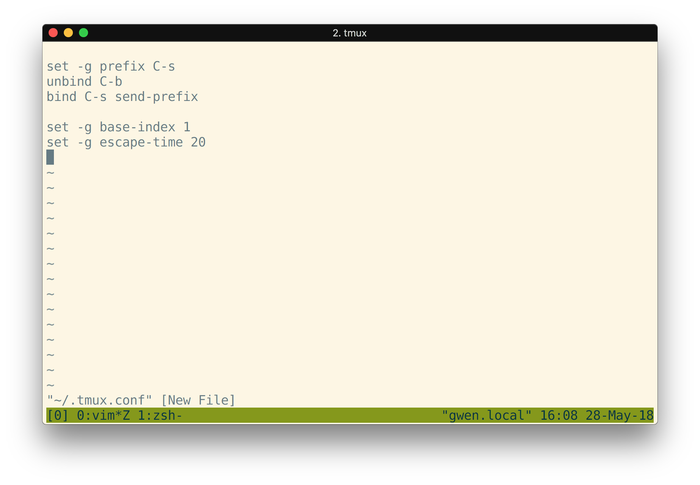

<table class="fragment absolute-center bg-solarized character-map">
    <tr><td>⬅️</td><td>⬇️</td><td>⬆️</td><td>➡️</td></tr>
    <tr class="fragment"><td>H</td><td>J</td><td>K</td><td>L</td></tr>
</table>

^ With that out of the way, let's make it easier to navigate around
panes. >> I'm a Vim user, so in my head I've mapped left, down, up, right
to >> H, J, K, L.

---

<h3 class="fragment solarized-text absolute-center">
    <code class="nowrap">
        bind
        h
        select-pane
        -L
    </code>
    <code class="fragment nowrap">bind j select-pane -D</code>
    <code class="fragment nowrap">bind k select-pane -U</code>
    <code class="fragment nowrap">bind l select-pane -R</code>
</h3>

^ So, let's >> bind the >> h key >> to select the pane >> to the left.
Now, "Ctrl+b h" will run the select-pane command with the -L option,
which goes left. Then let's >> bind j >> to down, bind k >> to up, and
>> bind l >> to right

---

^ But we're not limited to only using the prefix: We can bind keys so
they work all the time, not just after the prefix. Let's make it so
holding the Alt key and pressing h, j, k, or l will also switch between
panes.

---

<h3 class="solarized-text absolute-center">
    <code class="nowrap">
        bind -n
        M-h
        select-pane -L
    </code>
    <code class="fragment nowrap">bind -n M-j select-pane -D</code>
    <code class="fragment nowrap">bind -n M-k select-pane -U</code>
    <code class="fragment nowrap">bind -n M-l select-pane -R</code>
</h3>

^ So this time we use >> bind with the -n flag for "no prefix". We bind "Alt" "h".
The "M" stands for Meta, but since keyboards rarely have Meta keys, the
Alt key is usually used. >> And Alt-h selects the pane to the left.
Again, we do this for >> down, >> up, and >> right.

---

^ Now we can move through panes using Alt and h, j, k, and l.

---

# Reloading Config

^ Now that we've changed our configuration file, we need to load it. We
could just restart Tmux, but we could also load our new configuration
inside our current session.

---

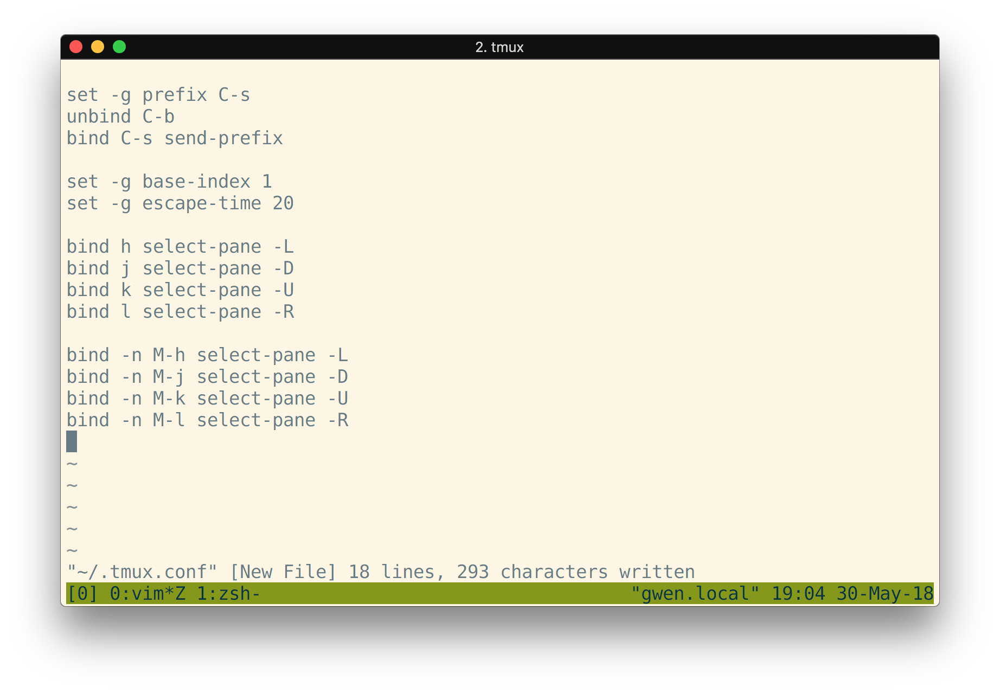

<h1 class="fragment absolute-center bg-solarized">
    <kbd>Ctrl+b :</kbd>
</h1>

^ We can load a config file using Tmux's "source" command. This command
isn't bound to a key, but we can use Tmux's command prompt to use it.
To show the command prompt, >> press Ctrl+b and then the colon key (`:`).

---

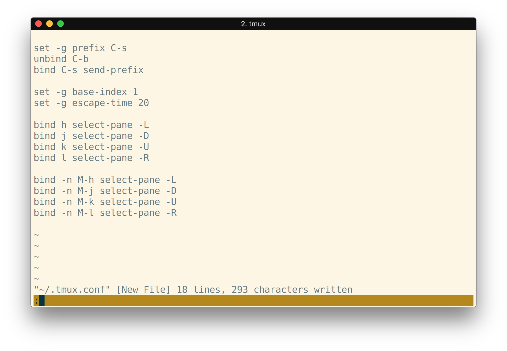

^ The status bar changes to the command bar

---

^ The command bar lets us execute Tmux commands. Everything we've
written in our configuration file so far has been a Tmux command, and
there are a lot more Tmux commands (and we'll get in to fun things you
can do with them a bit later)

---

<h2 class="fragment absolute-center solarized-search-text nowrap">
    :<kbd class="fragment">source</kbd>
    <kbd class="fragment">~/.tmux.conf</kbd>
</h2>

^ To load the config file, >> we use the "source" command, >> and give
it the file we want to load, "~/.tmux.conf". This acts like your shell's
source (or '.') command: it reads the file and executes the commands
inside to change your current settings.

---

^ With that done, our prefix is now Ctrl+s, and we can use our HJKL keys
to move between our panes. Notice that our windows are not numbered from
1 yet. This is because our config doesn't change existing windows. We
could fix this session with another command, but we won't.

---
{Topic}

# Theming

^ Of course, we cannot be maximally productive if we can't change how
things look.

---

^ Tmux lets us change the color and position of anything in the status
bar.

---

^ For example, the bottom bar's dark text doesn't have good contrast
against the medium green background.

---

^ And this right side here takes up a lot of space for things I don't
need. I may sometimes forget what day it is, but that's what my
smartphone is for...

---

<h2 class="fragment solarized-text absolute-center">
    <code style="display: block" class="nowrap">
        set -g
        status-bg
        black
    </code>
    <code style="display: block" class="fragment nowrap">
        set -g
        status-fg
        white
    </code>
</h2>

^ So let's configure a couple things. First, let's make the status bar
to have white text on a black background. So, we >> set (globally) the
>> status background >> to black. And we >> set the >> status foreground
>> to white

---

<h2 class="fragment solarized-text absolute-center">
    <code style="display: block" class="nowrap">
        set -g
        status-left-length
        20
    </code>
    <code style="display: block" class="fragment nowrap">
        set -g
        status-right-length
        20
    </code>
</h2>

^ Next let's configure the amount of space the left side (our session
name) and the right side (the date/time) are allowed to take up. We'll
need some more space for the session name soon, so let's set the
status-left-length to 20. We don't want the right side to take up as
much space as it is, so let's set that to 20 as well.

---

    <h1>
        <kbd>Ctrl+b :</kbd>
    </h1>
    <h2 class="fragment solarized-search-text">
        <kbd>:source ~/.tmux.conf</kbd>
    </h2>

^ Now we've got all this configured, so let's reload our configuration.
>> Remember that's "Ctrl+b :" to open the prompt, and then >> "source
~/.tmux.conf" to reload the config

---

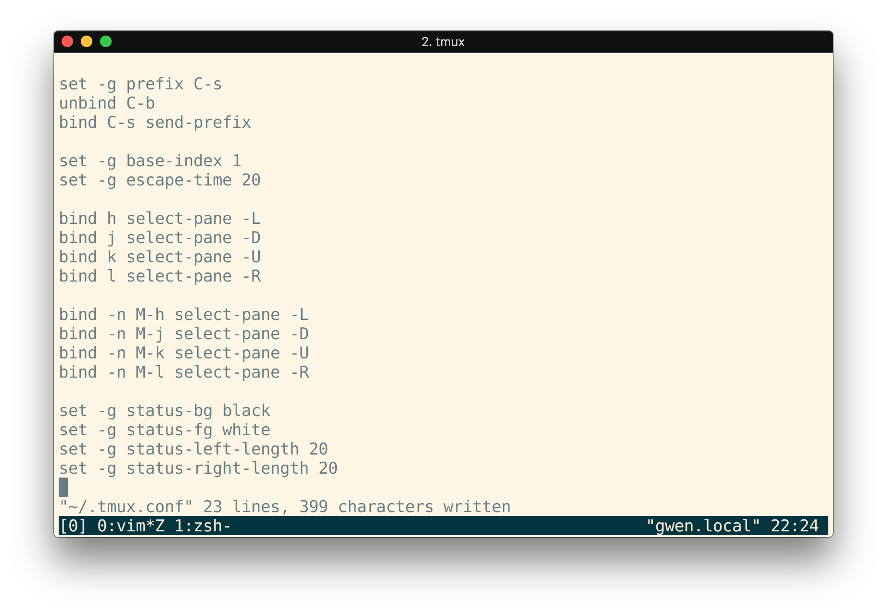

^ Voila! Our bottom bar is now black-and-white.

---

^ And only the hostname and the current time are shown on the right side
here

---

^ There are lots of other theme-related things you can do. There are
even plugins that add charts and other distractions down in the status
bar. Customize to your needs!

---

# Mouse üê≠ Tmux

## `set -g mouse on`

^ There are a lot more configuration options, including enabling the
mouse to select and scroll through the scroll buffer. I don't enable the
mouse, because I prefer how the mouse works in iTerm (my terminal), but
it can make selecting text easier than using the keyboard to move
around.

---
{Topic}

# Organizing Sessions and Windows

^ Remember that detaching and attaching sessions is one of Tmux's core
features. But what if we don't want to reattach to our running session?

---

^ If we just run `tmux` again without trying to attach...

---

^ we get a new session.

---

^ Notice in the lower left of the Tmux status bar, our session is now
`1`

---

^ Notice also that our first window is window 1, because of our
configuration

---

^ Now we have a new Tmux session completely unrelated to our last
session. We can open windows, split them into panes, start programs, and
etc... just like our previous session.

---

^ When we detach, tmux tells us we detached from session 1. Let's try
attaching again.

---

^ When we run `tmux attach`...

---

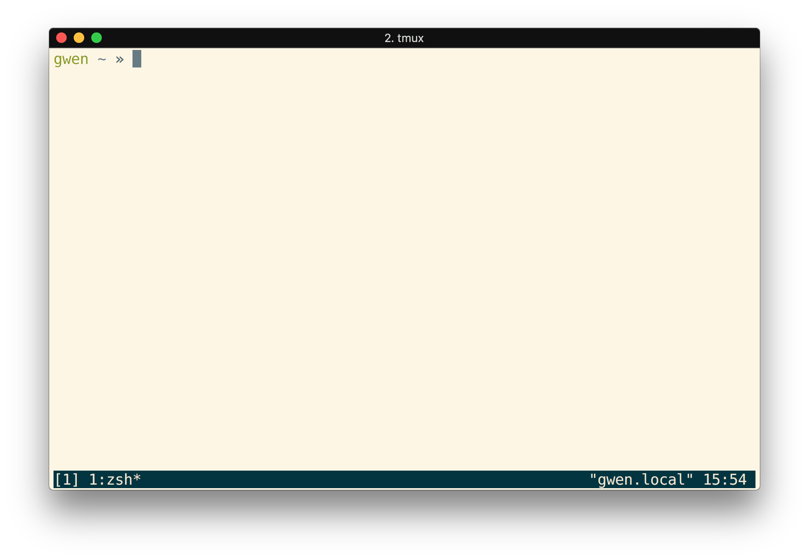

^ ... we get the last session we attached to. Handy!

---

^ But now how do we get to our first session, session `0`? If we use
`tmux attach` with the `-t` option, we can specify the target session we
want to attach to. In this case, session 0.

---

^ Okay, well, Tmux doesn't like being run inside Tmux. I forgot to
detach first.

---

^ Okay, so then I run `tmux attach -t 0`...

---

^ ... and now I'm back to session 0 looking at the window I detached
from.

---

^ If you want to know what Tmux sessions exist, or even whether Tmux is
running, you can run `tmux ls`.

---

^ This will list the running sessions and some information about them.
If there is no Tmux server running, it will tell you.

---
{Topic}

# Naming Sessions

^ But in order for us to use multiple sessions effectively, we need to
do something better than leaving them named as `0` and `1`. We can
instead give our sessions descriptive names: The project we're working
on, or the issue number we're working on.

---

    <h1>
        <kbd>Ctrl+b :</kbd>
    </h1>
    <h1 class="fragment">
        <kbd>Ctrl+b $</kbd>
    </h1>

^ We can rename a session we've created by using the `rename-session`
command. We can either use the Tmux prompt >> (`Ctrl+b :`) to run
`rename-session`, or we can use >> `Ctrl+b $`. I tend to end up using
the Tmux prompt a lot more, because it's easier to remember that
I rename sessions with `rename-session` than it is to remember I rename
sessions with `Ctrl+b $`

---

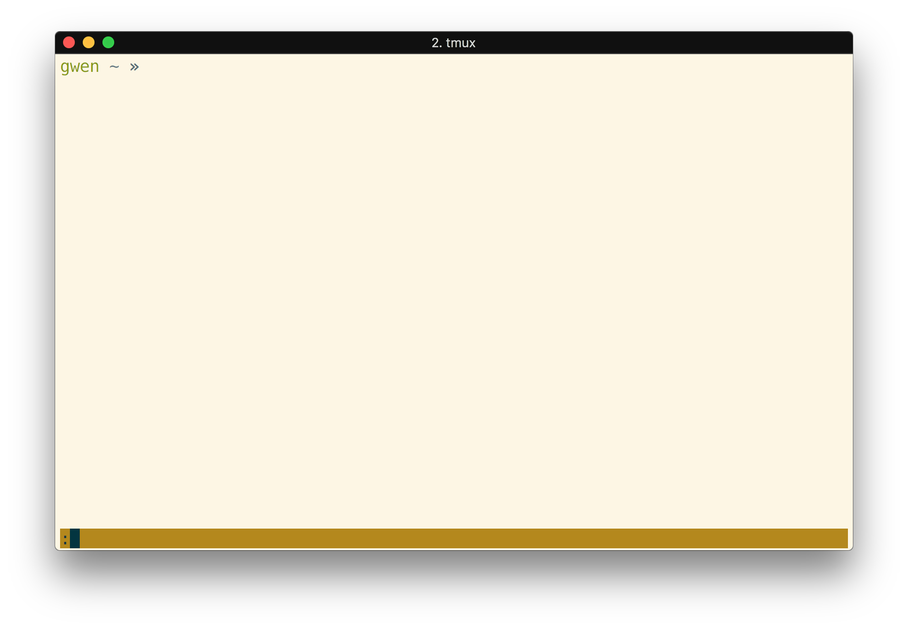

<h2 class="fragment absolute-center solarized-search-text nowrap">
    :<kbd class="fragment">rename-session</kbd>
    <kbd class="fragment">talk</kbd>
</h2>

^ So we just need to type >> Ctrl+b, colon... >> `rename-session` and
then the session's name. >> Let's call it "talk".

---

^ Then when we run that command...

---

^ our session is renamed.

---

^ ... our new name shows up in the bottom left.

---

^ It now also shows up in `tmux ls`...

---

^ ... with our new name.

---

^ Also notice that `tmux ls` tells us that this session is attached.
I took this screenshot in another window while my other window was
attached to this session.

---

    <h2>
        <kbd>tmux new-session</kbd>
    </h2>

^ We can also create new sessions with a name by using >> `tmux
new-session` 

---

    <h2 class="nowrap">
        <kbd>tmux new
            -s
            bugfix
        </kbd>
    </h2>

^ ... (or, for brevity, >> `tmux new`). >> The `-s` option lets us
specify a >> name when we create the session.

---

^ And now we have a session named "bugfix"

---

# Session Organization

^ I use sessions a lot. My current job has me bouncing around between
tickets 4-5 times per day. Each ticket touches different files and has
different tests.

---

^ So, for each ticket I start working on, I create a new session, named
after the ticket. Then I can attach to the session I want to work on,
do a bunch of work, and when I get interrupted to do some quick work on
another ticket, my workspace is safe in my Tmux session. This has helped
reduce the inertia of context-switching for me.

---
{Topic}

# Naming Windows

^ In addition to naming sessions, Tmux also lets you name windows.

---

^ Like I may have mentioned before, windows are generally named with the
program that's currently running

---

^ This window is running vim, my editor.

---

^ And this window is running zsh, my shell.

---

^ This is a pretty useful default, but let's create a new window.

---

^ Now I have two windows named "zsh".

---

^ Which is which? Which one am I using to run my tests, and which one am
I using to look up documentation?

---

    <h1>
        <kbd>Ctrl+b ,</kbd>
    </h1>
    <h2 class="fragment solarized-search-text nowrap">
        <kbd>:rename-window</kbd>
    </h2>

^ To rename a window, we can use >> `Ctrl+b` and comma, or the >>
rename-window command. This one I use so often that I remember the
shortcut.

---

<h2 class="fragment absolute-center solarized-search-text nowrap">
    <kbd>(rename-window)</kbd>
    
        <kbd class="fragment">zsh</kbd>
        <kbd class="fragment" style="position: absolute; top: 0; left: 0; right: 0; bottom: 0; background: rgb( 180, 136, 29 );">edit</kbd>
    
</h2>

^ Then, in the command prompt, we delete the current name and add our
own. Now the window will stay this name, even if we run a different
program in it.

---

^ Now I can easily remember...

---

^ ... which window has my editor...

---

^ ... which window is for tests

---

^ ... and which is for docs...

---
{Topic}

# Automation

^ Eventually (longer than it should have taken) I realized that I was
doing the same thing over and over again. When this happens, I've
learned to examine my process and see if something can be automated.

---

# Tmux Session

^ In this case, I was creating the same Tmux sessions with the same
windows running the same programs over and again

---

### Blog Session

^ When writing blog posts, I need a single window with my editor on one
side and a shell to run my website locally for testing.

---

### Backend Session

^ When working on the CPAN Testers backend, I prefer having one window
for my editor, so I can open multiple panes of code, and another window
for tests so I can quickly switch between testing and editing.

---

### CMS Session

^ And when working on Yancy, my CMS, I need one window for editing, one
for testing (with one pane for automated tests and one pane for a demo
site), and a third window to run two databases I support: Postgres and
MySQL. The tests require some environment variables as well.

---

# Tedious Setup

^ If I had to do this every day, I'd go nuts. Even if I had to do it
weekly, I'd get frustrated.

---

# Don't Forget!

^ Worse, in the last example, if I forgot to set everything up correctly,
I might fail my tests, or not run all my tests, resulting in releasing
bad code, which will start a fire and we'd all die.

---

# Automatic Session

^ So, to prevent this, I can automate the setup of my Tmux session.

---

# Tmux Commands

^ And we do that using Tmux commands. We've used Tmux commands to rename
sessions and windows, to move between panes, and to configure Tmux key
bindings. Tmux also has commands to create windows and panes, which
we've used the default key bindings to do.

---

# Run
# Tmux Commands
# Anywhere

^ But we don't need to be inside Tmux to run Tmux commands. We can run
Tmux commands for any of our running sessions from outside of Tmux. This
way, we can run a bunch of commands to set up our session before we
attach to it!

---

    <h2 class="nowrap">
        <kbd>tmux new
            -s yancy
            -d
        </kbd>
    </h2>

---
<!-- .slide: data-transition="slide-out-left" -->

---
<!-- .slide: data-transition="slide-in-left slide-out-right" -->

---
<!-- .slide: data-transition="slide-in-right" -->

# XXX

---

# Shell Script

---

<pre><code>if ! tmux has-session -t yancy; then
    tmux new -s yancy -d
    tmux new-window -t yancy:2
    tmux split-window -t yancy:2 -v
    tmux send-keys -t yancy:1 vim Enter
    tmux send-keys -t yancy:2.0 \
        'cd perl/Yancy && morbo bin/yancy' Enter
    tmux send-keys -t yancy:2.1 \
        'export TEST_YANCY_EXAMPLES=1' Enter
    tmux new-window -t yancy:3 \
        postgres -D perl/Yancy/db/pg
    tmux split-window -t yancy:3 mysqld \
        --skip-grant-tables --datadir=$HOME/perl/Yancy/db
fi
tmux attach -t yancy
</code></pre>

---

# Existing Solutions

^ There are some existing solutions for building Tmux sessions, if you
don't want to manage it yourself.

---

# Tmuxifier

^ Tmuxifier is basically shell scripts like this with a nice command
tool for managing sessions and windows.

---

# Teamocil

^ Teamocil is a bit different: It uses YAML files to configure sessions.
Same concept though: It's building Tmux sessions.

---
{Topic}

# Wrap-Up

---
{Topic}

# Questions?

---

# Thank You

<http://preaction.github.io/REPO_NAME/>

by [Doug Bell](http://preaction.me)  
<small>(he, him, his)</small>  
[<i class="fa fa-twitter"></i> @preaction](http://twitter.com/preaction)  
[<i class="fa fa-github"></i> preaction](http://github.com/preaction)  

[Chicago.PM](http://chicago.pm.org)  

[<i class="fa fa-file-text-o"></i> Notes](https://github.com/preaction/REPO_NAME/blob/master/NOTES.md)  
<small> </small>  
[Source on <i class="fa fa-github"></i>](https://github.com/preaction/REPO_NAME/)  

[CC-BY-SA 4.0](https://creativecommons.org/licenses/by-sa/4.0/legalcode)  

